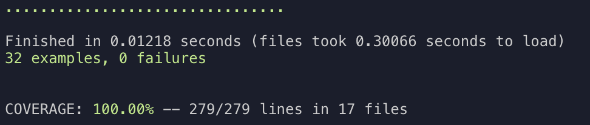
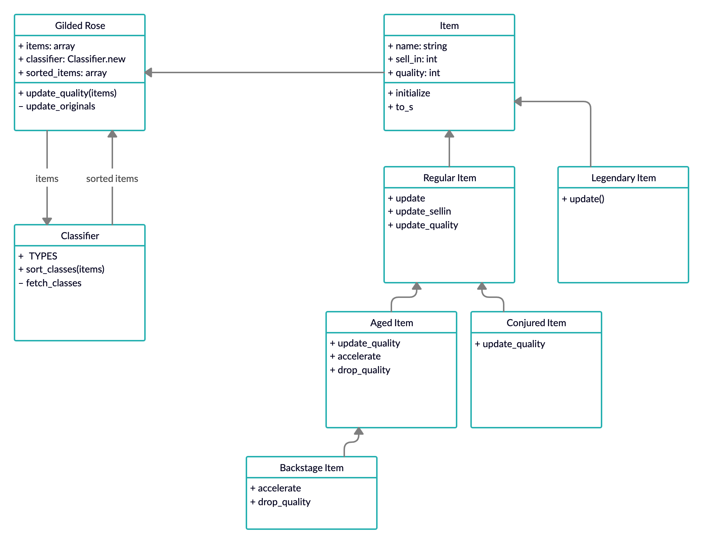

# GildedRose Refactoring in Ruby

Technical test in refactoring one of the most popular katas [Gilded Rose](https://github.com/emilybache/).
<br><br>

## How to Install

Clone the repository. In the project folder run:

```
bundle install
```

<br><br>

## How to Use

1. Run IRB or PRY in the project directory.
2. `require_relative './lib/gilded_rose'`
3. Create a list of items:

```
items = [
  Item.new(name = '+5 Dexterity Vest', sell_in = 10, quality = 20),
  Item.new(name = 'Aged Brie', sell_in = 2, quality = 0),
  Item.new(name = 'Elixir of the Mongoose', sell_in = 5, quality = 7),
  Item.new(name = 'Sulfuras, Hand of Ragnaros', sell_in = 0, quality = 80),
  Item.new(name = 'Sulfuras, Hand of Ragnaros', sell_in = -1, quality = 80),
  Item.new(name = 'Backstage passes to a TAFKAL80ETC concert', sell_in = 15, quality = 20),
  Item.new(name = 'Backstage passes to a TAFKAL80ETC concert', sell_in = 10, quality = 49),
  Item.new(name = 'Backstage passes to a TAFKAL80ETC concert', sell_in = 5, quality = 49),
  Item.new(name = 'Conjured Mana Cake', sell_in = 3, quality = 6)
]
```

4. Run `gilded_rose = GildedRose.new(items)`
5. Run `gilded_rose.update_quality to update the items for a given day.
<br><br>

## Tests

To run tests type

```
rake
```

**Test coverate**

<br><br>

## Approach

Every class has a single responsibility that can be described with one sentence:

**GildedRose** is the main interface for interaction with the bank account.

**Classifier** stores transaction details(date, credit, debit, balance).

**Item** records and formats the date of transaction.

**RegularItem** formats transaction history into a printable format.

**LegendaryItem** formats transaction history into a printable format.

**AgedItem** formats transaction history into a printable format.

**ConjuredItem** formats transaction history into a printable format.

**BackstageItem** formats transaction history into a printable format.



<br><br>
